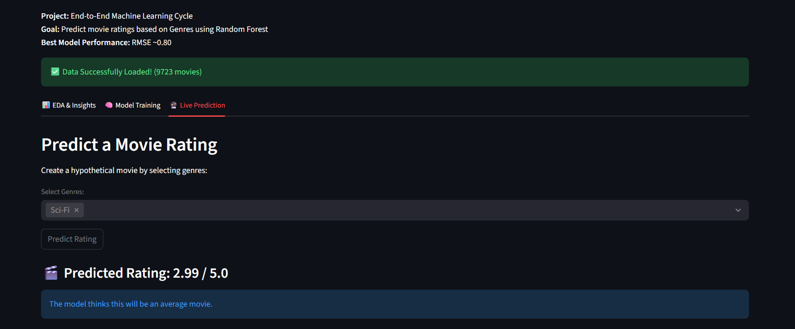

# MovieLens Rating Prediction

End-to-end machine learning project predicting movie ratings based on genres using the MovieLens dataset.

## Project Overview

Built a complete ML pipeline comparing three data preprocessing approaches:
- **API Experiment**: Enhanced missing genres using TMDB API
- **NLTK Experiment**: Predicting movie genres based on the similarity between words (title and genres)  
- **Delete Experiment**: Removed movies with missing genres

## Key Components

- **Data Processing**: Three experimental preprocessing pipelines
- **Model**: Random Forest Regressor with GridSearchCV optimization
- **Web App**: Interactive Streamlit dashboard for predictions and analysis
- **Performance**: RMSE ~0.80 across all approaches

## Streamlit Interface



## Quick Start

```bash
pip install -r requirements.txt
streamlit run src/app.py
```

## Project Structure

```
├── data/
│   ├── raw/           # Original MovieLens data
│   └── processed/     # Cleaned datasets from experiments
├── src/
│   ├── preprocessing/ # Three experimental approaches
│   ├── model/         # Random Forest implementation
│   └── app.py         # Streamlit web application
└── notebook/          # Analysis and visualization
```

## Results

All three preprocessing approaches yielded similar top-rated movies and model performance, demonstrating robust methodology across different data handling strategies.

## Presentation

[View Project Presentation](https://docs.google.com/presentation/d/18n5gS4Ftr-P3Fdv2Fde9hzXW4Ki9xmQAAeqlbcgEwF4/edit?usp=sharing)
